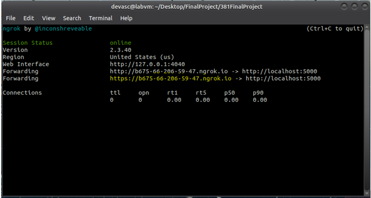

# 381FinalProject
This is where our CNIT381 Network Programmability and Automation Final is going to be
Everything in this project will be completed using several virtual machines running on virtual box.

GUI Ubuntu virtual machine with 4MB of memory allocated

Virtual router allocated 4MB of memory

Starting the bot…

a.	In a new terminal on your GUI virtual machine enter the command “ngrok http 5000”
   
b.	Copy the https address for later use 

c.	Open GenieRobot.py in virtual studio and paste the https address here:
 

