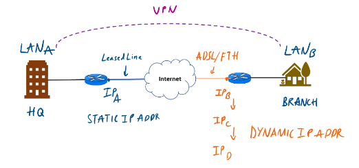
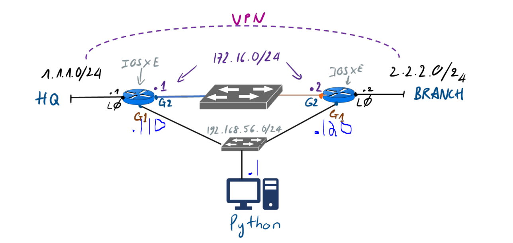
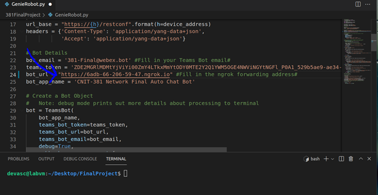

# 381FinalProject
This is where our CNIT381 Network Programmability and Automation Final is going to be.
Everything in this project will be completed using several virtual machines running on virtual box.

GUI Ubuntu virtual machine with 4MB of memory allocated

Two virtual routers allocated 4MB of memory each

The primary goal of this project is to build a bot that is capable of maintaining a vpn tunnel whith a branch router peer that recieves its connection via DHCP. Our secondary goal is to demonstrate our ability with other automation skills that we have integrated into our bot.

This is the topology that we are simulating, this topology shows that the gi2 interface on CSR2 receives DHCP addressing and our network needs to be resilient to this:

This is the topology we will be using:

PART 1 

Configure the devices...

a. copy the CSR1.txt config for to your router 1 VM and the CSR2.txt config to your router 2 VM.

b. pull from our github repository to a folder on your Ubuntu VM that will contain all your bot files.

PART 2

Configuring the bot...

a.	In a new terminal on your GUI virtual machine enter the command “ngrok http 5000” Copy the https address for later use. 

   

b. Open GenieRobot.py in virtual studio and paste the https address here:

   

c. Initial connectivity tests:

Check that R1 can ping 172.16.0.2 this should work

Check that R1 can ping 2.2.2.2 this should work

d. Chat with the bot: 

Interact with the bot and receive a greeting message by sending the bot a message like “hey”

Use the /help command to see what skills the bot has.

###NEED SCREENSHOT###

Now on R1 issue the ping command ping 2.2.2.2 repeat 40000

Finally change the IP address of Gi2 on CSR2 and we should see that the pings on CSR1 stop and then continue after the vpn tunnel is reestablished.

You can issue a "show run" command on CSR1 that shows that the config has changed.
